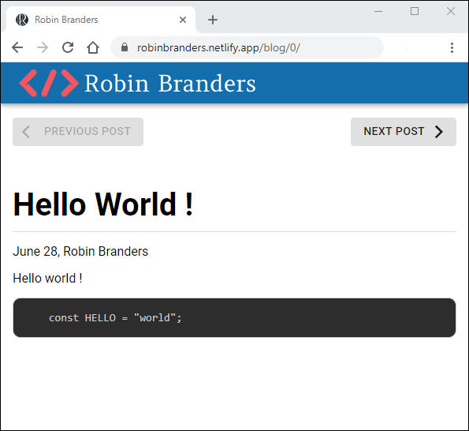
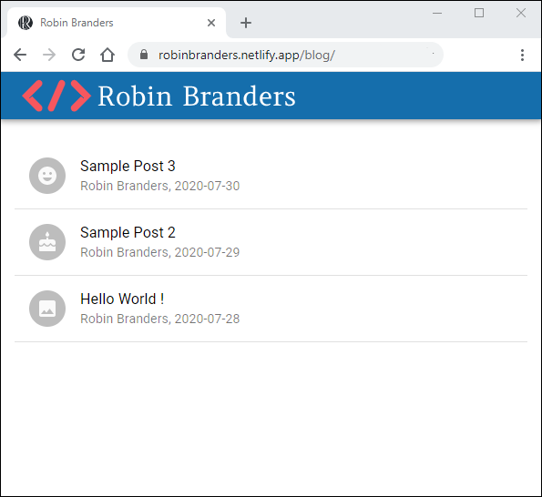

# Simple Markdown Blog On Netlify With React

July 30 2020, [Robin Branders](www.robinbranders.be)

## Introduction

For some time I wanted to setup a blog, and it is finally here. This article describes how I did it. I looked at the available options and came up with following constraints.

It had to be:

1. Free
2. Easy to add and format blogposts

## Netlify

I've used [Netlify](https://www.netlify.com/) in the past and its a fantastic website to deploy a static website fast and you can get started for free. They even provide a way to generate SSL certificates automatically.

You can deploy your webapp straight from [Github](https://github.com/). This will be the way I'm going to use to add new blogposts.

## Converting Markdown to HTML

The second requirement was that it had to be easy and fast to create new blogposts that's why I chose to write them as [Markdown](https://github.com/adam-p/markdown-here/wiki/Markdown-Cheatsheet) files and later convert them to HTML.

### Markdown library

The main webpage is built in [React](https://reactjs.org/). To convert markdown files I used the [react-markdown](https://www.npmjs.com/package/react-markdown) library. You give it markdown as a string and it will convert it to HTML elements.

```javascript
this.setState({md: "'# Hello World !\n\nJune 28, Robin Branders'"})
//...
<ReactMarkdown source={this.state.md} />
```

### Markdown styling

By default the markdown library renders plain HTML elements. [This](https://github.com/markdowncss) gives a good starting point.

### Image URI

The markdown files and images are not located in the same directory as the html file (more on that later). react-markdown gives the option the change the image url with `transformImageUri`. It calls a function with the original link as the parameter and will use the return value as the new link.

```React JSX
<ReactMarkdown
    source={this.state.md}
    transformImageUri={(a) => {
        return `/md/${this.getPostFolder(this.props.topic)}/${a}`;
    }}
/>
```

How this link is built will be discussed later.

### Syntax Highlighting

Another feature of the react-markdown library is that you can provide it with custom renderes. It will use the provided react elements rather than its default elements.

```javascript
import CodeBlock from "./CodeBlock";

<ReactMarkdown
    source={this.state.md}
    renderers={{code: CodeBlock}}
    transformImageUri={(a) => {
        return `/md/${this.getPostFolder(this.props.topic)}/${a}`;
    }}
/>;
```

To render code blocks I've provided it with a custom element that uses the [react-syntax-highlighter](https://www.npmjs.com/package/react-syntax-highlighter) library.

```javascript
import React, {PureComponent} from "react";
import PropTypes from "prop-types";
import {Prism as SyntaxHighlighter} from "react-syntax-highlighter";
import {tomorrow} from "react-syntax-highlighter/dist/esm/styles/prism";

class CodeBlock extends PureComponent {
    static propTypes = {
        value: PropTypes.string.isRequired,
        language: PropTypes.string
    };

    static defaultProps = {
        language: null
    };

    render() {
        const {language, value} = this.props;
        return (
            <SyntaxHighlighter language={language} style={tomorrow}>
                {value}
            </SyntaxHighlighter>
        );
    }
}

export default CodeBlock;
```

### Accessing Files

Each markdown file is hosted on Netlify as a static file inside its own folder.

`GET https://robinbranders.be/md/000_HelloWorld/post.md` will return:

```markdown
# Hello World !

June 28, Robin Branders

Hello world !

´´´JS
const HELLO = "world";
´´´
```

An index of all posts is stored in a JSON file (`GET https://robinbranders.be/md/config.json`):

```JSON
{
    "Posts": [
        {
            "folder": "000_HelloWorld",
            "date": "2020-07-28",
            "author": "Robin Branders",
            "title": "Hello World !",
            "tags": []
        },
        {
            "folder": "001_SimpleReactMarkdownBlogOnNetlify",
            "date": "2020-07-30",
            "author": "Robin Branders",
            "title": "Simple Markdown Blog On Netlify With React",
            "tags": ["Markdown", "React", "Material-UI", "Netlify", "GIT", "JS"]
        }
    ]
}

```

## React App

The blog landing page and the single blog post are built as two seperate react apps.

### Single blog post

On app is build to load all posts using `fetch`. It uses the `/md/config.json` to load the next and previous posts.



The main component loads the navbar, buttons and a inner component to acually load and convert the markdown file:

```javascript
<>
    <ToolbarComponent />
    <Container maxWidth="md">
        <Grid
            container
            direction="row"
            justify="space-between"
            alignItems="center"
            spacing={2}
            style={{marginTop: "10px"}}
        >
            <Grid item>
                <Button
                    variant="contained"
                    startIcon={<ArrowBackIosIcon />}
                    disableElevation
                    disabled={!(this.state.currentPost > 0) || this.state.loading}
                    onClick={this.goToPrevious}
                >
                    Previous Post
                </Button>
            </Grid>
            <Grid item>
                <Button
                    variant="contained"
                    endIcon={<ArrowForwardIosIcon />}
                    disableElevation
                    disabled={!(this.state.currentPost < this.state.Posts.length - 1) || this.state.loading}
                    onClick={this.goToNext}
                >
                    Next Post
                </Button>
            </Grid>
        </Grid>
    </Container>
    <UrlMarkdownTopic topic={this.state.Posts[this.state.currentPost]} didLoad={this.postDidLoad} />
</>
```

### Blog landing page

The blog lading page reads out `/md/config.json` and displays those entries in a list. It picks some random icons to show next to each entry.


