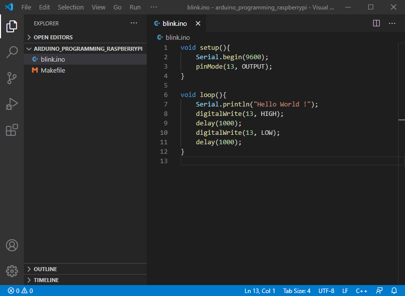
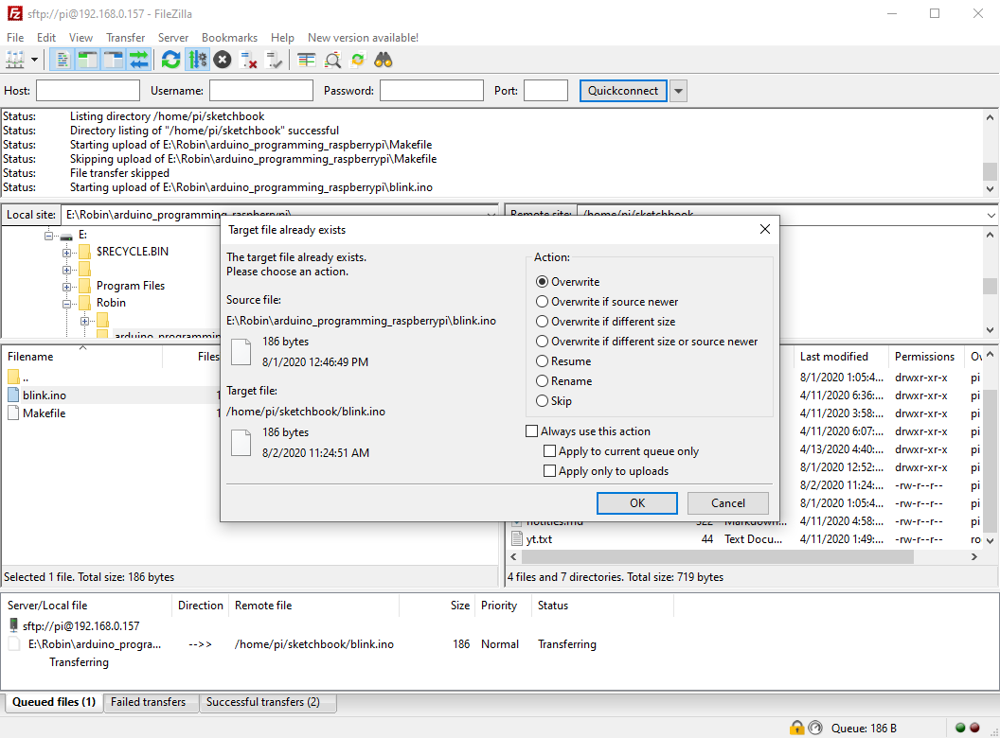
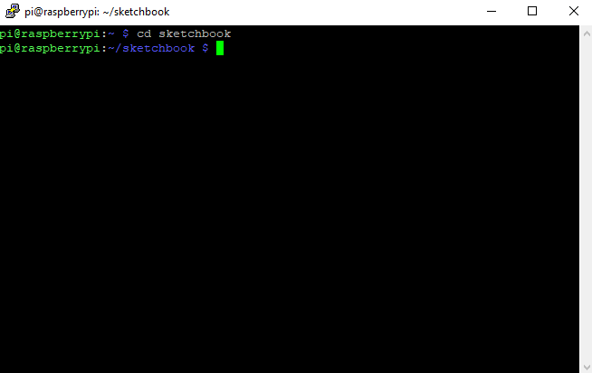
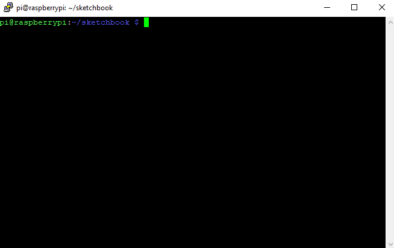

# Remote Arduino Programming With Raspberry Pi

August 1, 2020, [Robin Branders](www.robinbranders.be)

## Introduction

Usually my Arduino projects quite substantial and living on the project bench for some time. I wanted to find a way where I could do the coding part of the project from the living room or even monitor it from a remote location.

This article describes how to setup a Raspberry Pi to program an Arduino and de workflow I use to code remotly.

## Remote Workflow

Let's start with whole setup working.

1. Sketches are written on my laptop in [vs code](https://gist.github.com/wsh32/19d37709bfb5bea4915e810f03b4f26c)



2. The sketch is transfered to the Raspberry Pi via ftp



3. After that I open a terminal to compile the sketch and download the code



4. Monitor the serial port



## Programming The Arduino

In order to compile the sketches you need to install folowing program

```bash
sudo apt-get install arduino-mk
```

create a `sketchbook` directory and a `libraries` directory inside the `sketchbook` folder

```bash
pi@raspberrypi:~ $ ls
Desktop    Downloads  Music  Pictures  sketchbook  Videos
Documents  MagPi      node   Public    Templates
```

In order to compile a sketch you need to a `Makefile`:

```mk
# Define the Arduino director (to find default libraries)

ARDUINO_DIR = /usr/share/arduino

# Where to find the arduino
# On the Raspberry an arduio will show up as ttyACM0 or ttyACM1 ...
# This will work if only 1 arduino is connected

ARDUINO_PORT = /dev/ttyACM*

# Path for custom libraries

USER_LIB_PATH = /home/pi/sketchbook/libraries

# Define what board you are using

BOARD_TAG = uno

# Reference the original Make file from the arduino-mk install

include /usr/share/arduino/Arduino.mk

```

For the Arduino Nano 328 set `BOARD_TAG` to `nano328`

The sketchbook should now look something like this:

```bash
pi@raspberrypi:~/sketchbook $ ls
libraries       Makefile     blink.ino
```

1. To compile the ino file type `make` This wil generate a folder: `build-uno` with all the binary code.

2. To upload type `make upload`

3. To clean up the `build-uno` folder type `make clean`

These three steps can be combined into a single command:

```bash
make upload clean
```

## Monitor The Serial Port

```bash
sudo apt-get install screen
```

To open a serial monitor type:

```bash
make monitor
```

To exit type `ctrl a` and `ctrl d`. The monitor is nog still running in the background. To list all active screens type:

```bash
screen -list
```

To terminate it type

```bash
screen -X quit
```

## References

-   [Upload a Sketch from the Terminal](http://thezanshow.com/electronics-tutorials/arduino/tutorial-11)

-   [BOARD_TAG names](https://gist.github.com/wsh32/19d37709bfb5bea4915e810f03b4f26c)
