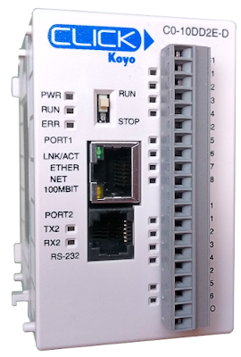
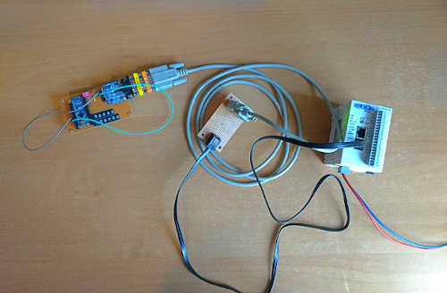
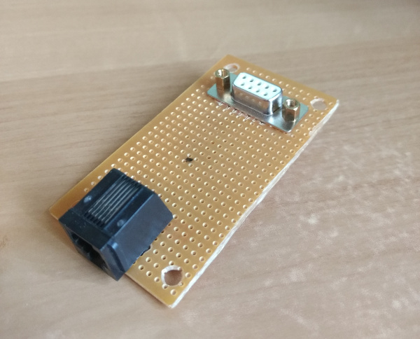
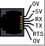
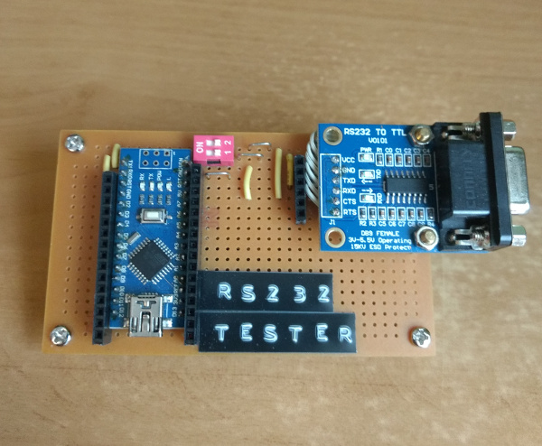
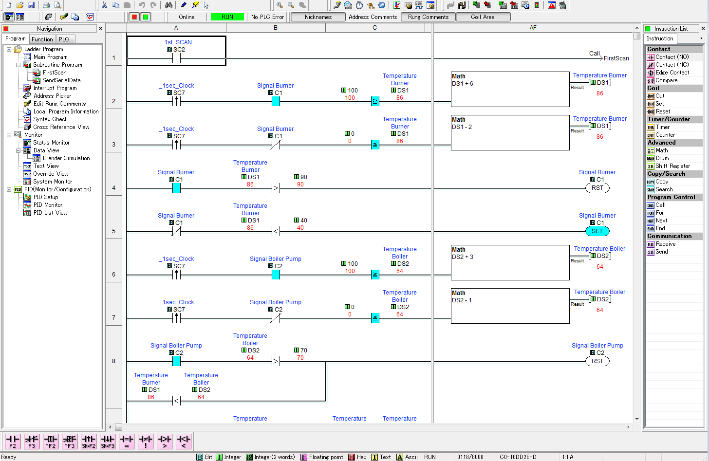
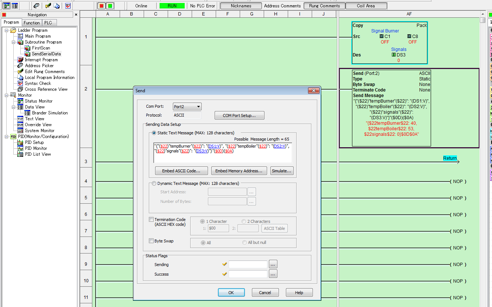

# Click PLC serial communication with Arduino

October 28, 2020, [Robin Branders](www.robinbranders.be)

## Introduction



The [Koyo Click C0-10DD2E-D](<https://www.automationdirect.com/adc/shopping/catalog/programmable_controllers/click_series_plcs_(stackable_micro_brick)/plc_units/c0-10dd2e-d>) PLC has one serial RS232 communication port that can be used for ASCII or Modbus communication.

In this article I use an Arduino and an of the shelf RS232 converter to read out serial data.

## Hardware



Used hardware:

- Click PLC
- RJ12 cable
- RJ12 to DB9 Adapter
- DB9 Cable
- DB9 adapter
- RS232 Test Board
  - RS232 to TTL converter
  - Arduino Nano

## Click Serial Port

The PLC uses a RJ12 connector for the RS232 port. Because RS232 usually uses a DB9 cable, I've made a adapter board to go from RJ12 to DB9.



The pinout for eacht PLC can be found on the product website. The C0-10DD2E-D CPU has following pinout:

| Pin | Name | Description     |
| --- | ---- | --------------- |
| 1   | 0V   | GND             |
| 2   | 5V   | 5V              |
| 3   | RXD  | Data receive    |
| 4   | TXD  | Data transmit   |
| 5   | RTS  | Request to send |
| 6   | 5V   | GND             |



## RS232 Test board

The output of the PLC is connected to a test board. This board consists of:

- RS232 to TTL converter
- Arduino Nano



The RS232 converter board is connected to D10 and D11 for the Arduino. Im using a software serial library so the hardware serial port can be used for other things.

| RS232 PIN | Arduino Pin |
| --------- | ----------- |
| TXD       | D10         |
| RXD       | D11         |

A DB9 Null modem is used to cross ofver the RX and TX signals.

## Arduino sketch

The Arduino sketch is super simple. It reads data on the software serial port and writes that to the hardware serial port.

In the future this can be used for some more complex processing. Or converting the serial PLC data to I²C for example.

```C++
#include <SoftwareSerial.h>

SoftwareSerial mySerial(10, 11); // RX, TX

void setup()
{
  //Hardware Serial
  Serial.begin(9600);

  //Software Serial
  mySerial.begin(9600);
}

void loop()
{
  if (mySerial.available())
    Serial.write(mySerial.read());
  if (Serial.available())
    mySerial.write(Serial.read());
}

```

## Click program

The PLC is running a heater simulation to generate some data.



A send command is fired periodically to send the serial data. The config of this command represents a JSON structure.

The data in between round brackets are embedded ASCII charasters `($22)` or references to PLC address values `(DS2:V)`

```
"{"($22)"tempBurner"($22)": "(DS1:V)","($22)"tempBoiler"($22)":"(DS2:V)",
"($22)"signals"($22): (DS3:V)"}"($0D)($0A)

```



## Serial output

The Arduino is plug into a PC. The serial output looks something like this.


And that's it for this article. The serial output can be used by a nodejs application thats running on a Raspberry Pi and monitors the serial port. The JSON over serial can then be used directly by the application.
